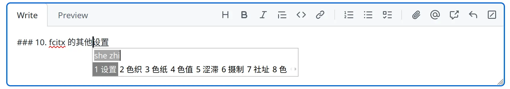
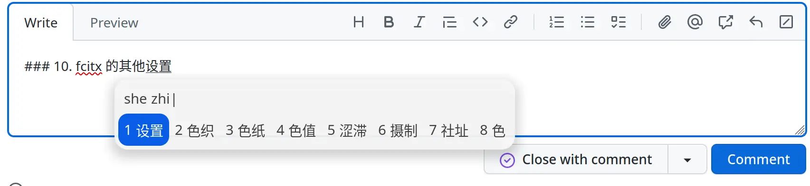

我很找之前使用的操作系统是 Manjaro, 是安装在自己的迷你主机上的. 后面, 自己买了 thinkbook 14+ 2023 后, 就打算使用 windows 11 和 wsl2 了. 原因是我的笔记本电脑只支持 s0 睡眠, 我不久前看了 archlinux 的 wiki 后才知道原来现在 linux 能很好地支持 s0 睡眠了, 甚至比 windows 11 还好, 因为他不会像 windows 11 一样, 在睡眠的时候莫名其妙地发热. 目前使用下来, 比 windows 11 好多了.

我这里记录一下, 安装的过程, 和一些后续的配置.


## 安装

我在安装的时候, 为了稳定性, 使用了离线安装, 所以, 默认的桌面是 xfce4, 我后续要做的就是安装 gnome, 然后把 xfce4 给删掉.

### 1. 删掉 xfce4

```bash
sudo pacman -Rns xfce4 xfce4-goodies
rm -r ~/.config/xfce4
```

### 2. 安装 gnome

```bash
sudo pacman -S gnome gnome-extra
```

### 3. 删掉 lightdm

```
sudo systemctl -f enable --now GDM
sudo pacman -Rnsc lightdm 
```

然后重启就可以了

## 配置

接下来介绍一下, 后续的配置.

### 1. 输入法

参考了[Fcitx 最佳配置实践 2023-09-11 ](https://manateelazycat.github.io/2023/09/11/fcitx-best-config/)来装 fcitx, 输入法使用了[雾凇拼音](https://github.com/iDvel/rime-ice). 不过由于我不太熟悉 rime, 所以, 我使用了雾凇拼音推荐的[自动部署脚本](https://github.com/Mark24Code/rime-auto-deploy)


### 2. 科学上网

我是用的是 clash-verge, 然后配置 proxychains 能解决大部分的网络问题. 不过, 由于 proxychains 自身的缺陷, 所以, 我打算使用 lazycat 推荐的 proxy-ns, 不过配置 proxy-ns 的过程遇到了很多坑, 记录在[这里](https://github.com/tcstory/blog/issues/24)了. 说话, proxy-ns 确实很好用.

### 3. 下拉式终端

我在开发过程中, 会严重以来终端加上 tmux. 很多命令, 比如运行服务, 操作 git 都是通过终端来完成的. 我的个人习惯是, 把打开终端的快捷键映射到 `F2`, 使用到的时候, 按一下, 就能立刻切换一个终端.

但是 gnome 40 以上的版本, 其实可选的下拉终端会少一点, 而且, 即使你找到了, 很多下拉终端就根本没有适配 gnome 45, 所以, 最后我只能找到了老牌的 guake terminal. 然后再配置 `wl-clipboard` 就能很好的打通系统的剪切板了.

但是, 我发现, 当你想从系统剪切板往 guake 粘贴东西的时候, guake 往往会原地卡死, 比如手动 `toggle` 一下才能让他恢复, 然后也才能看到刚刚粘贴进来的内容. 后面我不得以尝试了其他的终端, 比如 ddterm 等, 发现他们都存在这个问题.

在 guake 的仓库里面, 终于看到有一个人提到了相同的[问题](https://github.com/bugaevc/wl-clipboard/issues/172). 按照它的做法, 我终于解决了这个问题.

还有一个问题是, 当你停留在 gnome 的桌面的时候, 你会发现快捷键失效了. 为了解决这个问题, 你需要多添加一个快捷键. 在**设置**里, 添加一个自定义快捷键, 名字叫作 guake, 然后命令是 `guake-toggle` 就可以了.

### 4. dock

很出名的 dash to dock 也是没有适配 gnome 45, 在这里我想吐槽一下 gnome 的兼容性. 最后, 好不容易找到了一个自从 gnome 45 的, 叫作 Dash2Dock

2023-10-20 更新: dash to dock 现在已经支持 gnome 45 了, 它比 Dash2Dock 好用多了.

### 5. 主题

主题使用的是 `MAC` 风格的, 叫作[WhiteSur-gtk-theme ](https://github.com/vinceliuice/WhiteSur-gtk-theme)

### 6. 待机方面

同样是使用 s0 待机, 然后使用 gnome 的电池管理的默认设置, 从昨晚 20:00 88% 的电池, 到第二天 10:00 82% 的电池. 看起来似乎还可以吧

## 7. 字体设置

字体设置参考了 [
Linux 下的字体调校指南](https://szclsya.me/zh-cn/posts/fonts/linux-config-guide/), 弄完后, 显示效果就很棒了.

## 8. fctix 输入法自动切换

我通常使用 webstorm 配合 ideavim 来写代码. 这样我能比较好地通过键盘来操作. 我的 .ideavimrc 如下所示:

```bash
set hlsearch                    " highlight searches
set incsearch                   " do incremental searching, search as you type
set ignorecase                  " ignore case when searching
set smartcase                   " no ignorecase if Uppercase char present
set clipboard+=unnamedplus  " 使用系统粘贴板(vim用y粘贴的内容也可以通过command + c 粘贴)
set keep-english-in-normal-and-restore-in-insert " 配合 IdeaVimExtension 插件, 可以在进入 normal 模式的时候, 自动切换到英文输入法
set clipboard+=ideaput

let mapleader="\<space>"
nnoremap <leader>n :tabn<cr>
nnoremap <leader>p :tabp<cr>
nnoremap <leader>1 :NERDTreeFocus<cr>

set NERDTree
```

当然了, 我平时也会使用 neovim 来进行快速编辑, 或者查看文件, 所以, neovim 也需要类似的功能. 你只需要配合 h-hg/fcitx.nvim 就能完成这个功能

### 9. 点击 dash to dock 里面的挂载磁盘的图标, 使用了 vscode 来打开磁盘

如标题所示, 如果你点击了 dock 里面的磁盘图片, 肯定希望使用文件管理器来打开. 这个问题似乎是安装了 vscode 以后导致的. [相关的讨论在[这里](https://gitlab.gnome.org/GNOME/nautilus/-/issues/2662), 使用里面提到的方法来解决就可以了, 我这边需要重启一下电脑才能让设置生效


### 10. fcitx 的其他设置

#### 安装 Input Method Panel

有一次我进入系统后, 系统提示我可以安装一个输入法相关的扩展, 然后我试了一下, 截图如下所示:




看起来确实美观了不少

#### fcitx 候选窗在 webstorm 中不跟随光标

这个问题暂时挂着, 以后等我找到好一点的方法了再处理