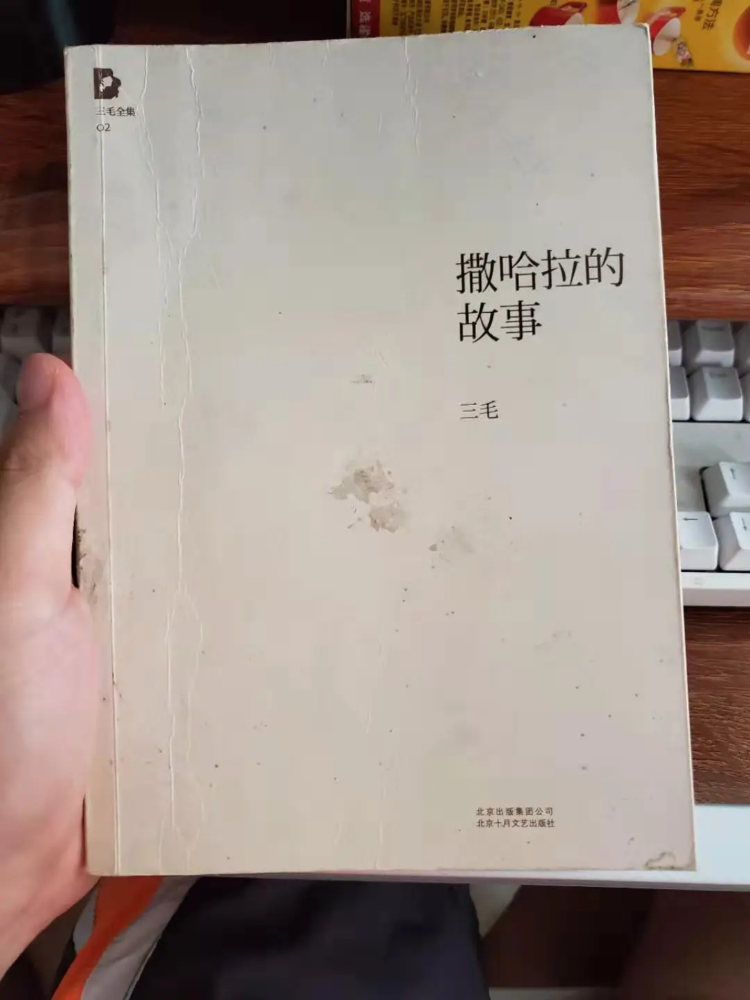
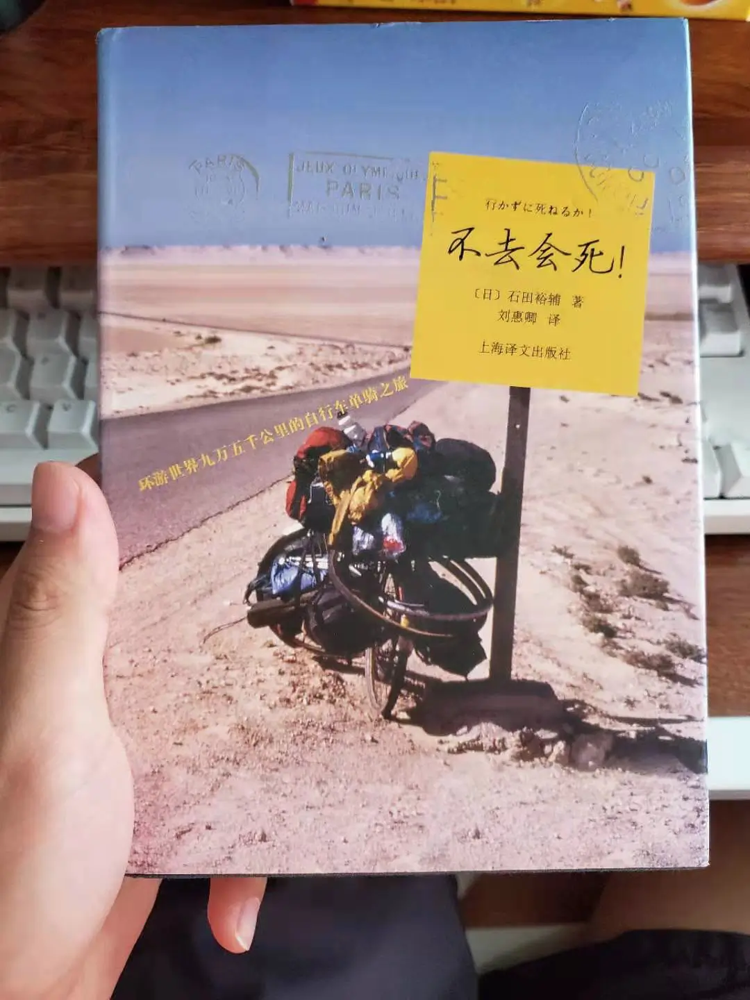

在家里面也呆了半个月了，除了看 eopl3 以外，自己又重新读了以前高中读过的书，一本是三毛的《撒哈拉的故事》，这本已经看完，昨晚开始看的是《不去会死》，这是一位日本人骑自行车环游世界后写下来的游记. 《撒哈拉的故事》这本书是我特别喜欢看的, 里面的故事很吸引人, 所以我回来在家后, 第一本看的书就是它. 昨晚开始看《不去会死》后, 才看了几页就停下来了, 因为我觉得这本书的叙述方式有点矫情, 而且, 作者环游世界花了 7 年多, 我很怀疑作者描写的关于刚出发的时候所发生的一些事的细节, 很可能是事后脑补上去的, 不然作者的记忆力也太好了(也许作者也有写日记的习惯吧). 所以我很快就决定不再看这本书了. 可能这本书相比于 《撒哈拉的故事》, 在我看来缺少了一些真情实感.

我觉得人的成长阶段, 可能需要的是不同类型的书籍来陪伴, 比如我很想再去买 《读者》这样的杂志, 但是又怕里面的无病呻吟的文章太多, 看起来没"营养". 但是想想看, 即使现在 《读者》已经不适合我了, 但是它确实在我高中寂寞和迷茫的时候陪伴着我. 其实我现在的有些思想和对人生的思考, 就是从这本杂志上来的. 我特别喜欢在《读者》上看过的朱德庸的《 在一个时代里缓慢行走》, 这本书给了我很多对人生的思考, 还有潘云贵的《我们的青春长着风的模样》,不过这篇文章现在看来也有点矫情, 但是我当初看的时候, 还是高中, 看了之后, 想到我现在过的每天都是 3 点 1 线的生活, 有数不完的作业和考试, 让我忍不住的去考自己的未来, 也充满了迷茫. 在读高三的时候, 我无心上学, 每天都从教室的窗户, 透过防盗网望向远方思考, 就如同笼中鸟在思考着如何能得到自由.

如果你要问我, 我和别人有何不同, 可能就在于, 我回去思考人生和未来, 并且很看重自由.

现在的文字狱也搞得很重, 所以我也不太看什么书了, 因为我怕书已经被偷偷的"阉割"掉了, 看这种书估计会让自己脑残吧.

人们往往害怕肉体上的阉割, 但是对于思想上的阉割却不以为然, 这其实也很好解释, 因为人没有办法去思考他没有见过的东西, 比如思想自由.

其实自己的思考, 也有很多受到了龙应台,李开复和易中天等人的影响, 这些以后再聊吧.

最后, 上一下书的封面.

