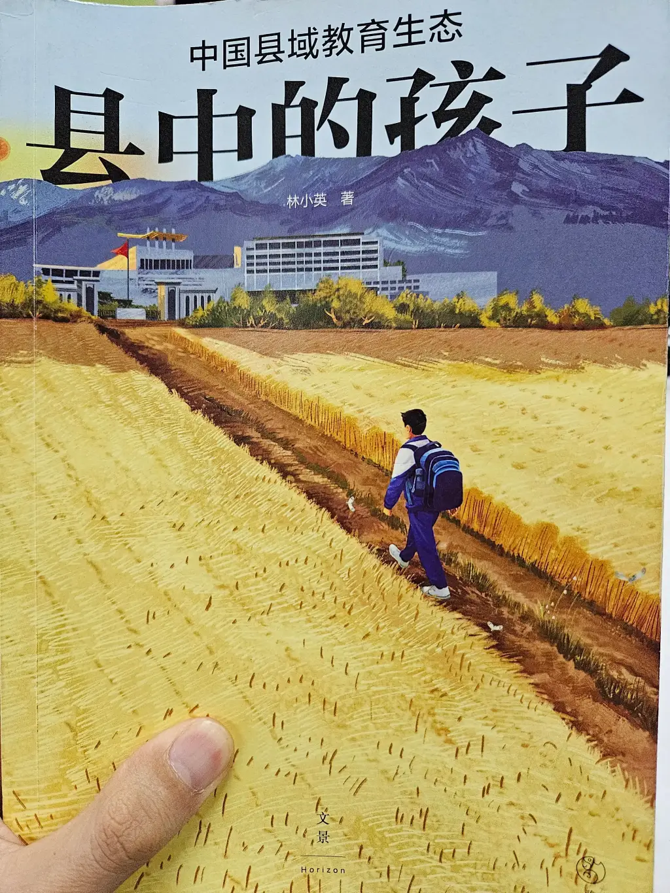

这是一本很值得阅读的书。看了这本书， 也让我理解了， 为何在我小学升初中的时候，成绩使用 A, B, C 来代替具体的分数。也理解了为何在中考的时候， 校长反复和我们强调， 我们的目标只有县里面的 xx 中学。

下面是从书中的一些总结。

我们的教育要考虑到，初中和高中，也许就是一些人一生的最高学历。他们从学校毕业后，可能一生都不会再踏入学校了，后面就是忙忙碌碌地谋生。如果他一辈子有注定了只能高中毕业，那么高中就有义务提供给他最基本的知识、能力、情感和价值的培养。

学校应该赋予孩子一生中最重要的情感资源。如果一个人只接受了高中教育，那么他一生中最重要的情感关系很可能就是在高中建立起来的。但是现在很多学校片面地追求成绩，同学之间的恶性竞争导致彼此的关系冷漠。

“技术治理主义”几乎盛行于体制内外的所有正式组织之中，管理表格化、能力表演化、工作绩效化、绩效数字化等“审计文化”让人不仅要完成本职工作，还要学会让自己的领导能看到、看明白，方便报表、统计和核定是否合规和优秀。